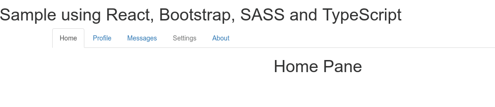

# 01 Basic Implementation

In order to run this example you need to:

- Clone the repo using `git clone`.
- Go into *01 Basic Implementation* and use `npm install`.
- Open the example using `npm start`.
- Go to [http://localhost:8080](http://localhost:8080)

Source code:
```jsx
<TabsComponent selectedTab="Home" animate>
  <TabPane name="Home">
    <h1 className="text-center">Home Pane</h1>
  </TabPane>
  <TabPane name="Profile">
    <h1 className="text-center">Profile Pane</h1>
  </TabPane>
  <TabPane name="Messages">
    <h1 className="text-center">Messages Pane</h1>
  </TabPane>
  <TabPane name="Settings" disabled>
    <h1 className="text-center">Settings Pane</h1>
  </TabPane>
  <TabPane name="About">
    <h1 className="text-center">About Pane</h1>
  </TabPane>
</TabsComponent>
```

Demo:



TODO: documentation
